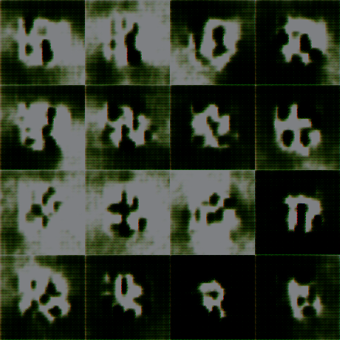
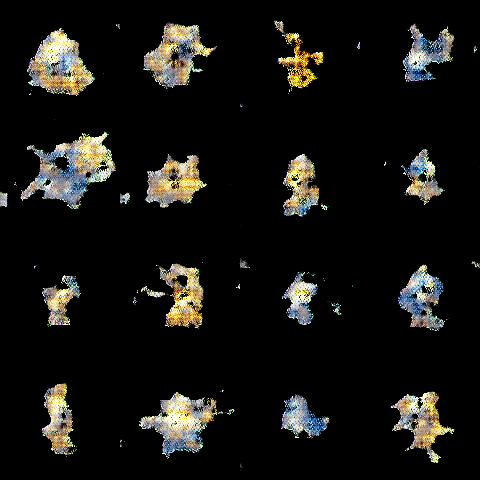

# Image generation using the mloperations package

An image generation example using [the mloperations package](https://github.com/kostaleonard/mlops).

**Note: All code is designed to be run from the project root.**

Task: Generate 120 x 120 x 3 images of Pokemon. The method demonstrated in this project is a DCGAN.

Dataset: The Pokemon dataset is available in the [data directory](data) for ease of use;
the dataset was taken from [Kaggle](https://www.kaggle.com/vishalsubbiah/pokemon-images-and-types).

## Sample output

The goal of this project is to demonstrate ML Ops techniques such as dataset and model versioning on an image generation
task. The main artifacts are versioned datasets, versioned models, and the output of the generative model. Please
refer to [the mloperations package](https://github.com/kostaleonard/mlops) for a more complete discussion of the need
for ML Ops techniques in machine learning workflows.

### Versioned datasets

Versioned datasets are snapshots of the tensors and data processing pipelines used to train, validate, and test models.
Dataset versioning helps ensure reproducibility. The following is an example versioned dataset output.

#### Versioned dataset publication

```python
# Adapted from imagegen/publish_dataset.py
from mlops.dataset.versioned_dataset_builder import VersionedDatasetBuilder
processor = PokemonGenerationDataProcessor()
builder = VersionedDatasetBuilder('data', processor)
builder.publish('datasets', 'v1', tags=['image', 'generation'])
```

#### Versioned dataset artifacts

```bash
$ tree datasets
datasets/
└── v1
    ├── X_test.npy
    ├── X_train.npy
    ├── X_val.npy
    ├── data_processor.pkl
    ├── meta.json
    └── raw
        ├── images
        │   ├── abomasnow.png
        │   ├── abra.png
        │   ├── absol.png
        │   ├── accelgor.png
        │   ├── aegislash-blade.png
        │   ├── aerodactyl.png
...
```

### Versioned models

Versioned models consist of not only the saved model files, but also metadata including the hyperparameters, training
history, and a link to the dataset on which the model was trained.

#### Versioned model publication

```python
# Adapted from imagegen/train_model.py
from mlops.dataset.versioned_dataset import VersionedDataset
from mlops.model.versioned_model_builder import VersionedModelBuilder
dataset = VersionedDataset('datasets/v1')
gen_builder = VersionedModelBuilder(dataset, gan.generator, training_config)
dis_builder = VersionedModelBuilder(dataset, gan.discriminator, training_config)
gen_builder.publish(gen_publication_path, tags=['generator'])
dis_builder.publish(dis_publication_path, tags=['discriminator'])
```

#### Versioned model artifacts

```bash
$ tree models
models
├── checkpoints
│   ├── gan_discriminator.h5
│   └── gan_generator.h5
└── versioned
    ├── 2021-12-29T11:38:14.870378
    │   ├── discriminator
    │   │   └── 2021-12-29T11:38:14.894275
    │   │       ├── meta.json
    │   │       └── model.h5
    │   └── generator
    │       └── 2021-12-29T11:38:14.870402
    │           ├── meta.json
    │           └── model.h5
...
```

### Generated images

The purpose of this project is to demonstrate a complete workflow within an ML Ops framework, and as such we did not
spend significant time training the best possible model. In future work, we plan to improve generated image quality. The
following are 4 x 4 grids of output images from the baseline model at 5 and 5000 epochs, respectively.

```python
# Adapted from imagegen/model_generate.py
from mlops.model.versioned_model import VersionedModel
versioned_generator = VersionedModel(versioned_generator_path)
versioned_discriminator = VersionedModel(versioned_discriminator_path)
gan = GAN(versioned_generator.model, versioned_discriminator.model)
images = gan.generate(16)
```

#### 5 epochs



#### 5000 epochs



## Modules

1. [pokemon_generation_data_processor.py](imagegen/pokemon_generation_data_processor.py): Defines how to translate the
   raw images and CSV data at the raw dataset directory into feature tensors.
2. [publish_dataset.py](imagegen/publish_dataset.py): Publishes a new version of the dataset. This module only needs to
   be run if the data processor changes.
3. [train_model.py](imagegen/train_model.py): Trains and publishes a new model.
4. [model_generate.py](imagegen/model_generate.py): Uses versioned models to generate new images.
5. [gan.py](imagegen/gan.py): Defines GAN architecture, loss functions, training loop, etc.
6. [errors.py](imagegen/errors.py): Custom errors.

## Notebooks

1. [prototype_model.ipynb](notebooks/prototype_model.ipynb): Prototypes models and investigates results. Contains the
   full ML pipeline, including versioned dataset publication, versioned model publication, and image generation.

## Run instructions

### Notebook

The easiest way to run and understand this example is to run [prototype_model.ipynb](notebooks/prototype_model.ipynb),
which contains all steps of the ML pipeline. The notebook first publishes a versioned dataset if one does not already
exist, creates a new prototype GAN, trains and publishes the versioned model, and examines generated output.

### Python scripts

You can also run each of the scripts individually from the project root.

#### 1. (Optional) publish a versioned dataset

This step is optional because the training script automatically publishes a versioned dataset if none exist. You can
publish a dataset by running the following. If a dataset of the same version as defined in the script already exists,
this will raise a `PublicationPathAlreadyExistsError`. If you make any changes to
`pokemon_generation_data_processor.py`, publish a new dataset by incrementing the version in `publish_dataset.py` and
running the script again. This script exists as a standalone module because you may want to publish a dataset without
training a model.

```bash
PYTHONPATH=. python imagegen/publish_dataset.py
```

At the project root directory, you will now see `datasets/v1` containing the published versioned dataset. You
can change the arguments to `publish()` to change the path (to a local or remote--e.g., S3--destination), version, and
tags.

#### 2. Train and publish a versioned model

Train and publish a versioned model with the following. If no versioned dataset exists, one will be created.

```bash
PYTHONPATH=. python imagegen/train_model.py
```

Again at the project root directory, there will now be a `models/versioned` directory containing models
versioned by timestamp. The `checkpoints` directory contains model checkpoints in case training is interrupted.

#### 3. Run model prediction

Retrieve the latest versioned model and generate new images with the following.

```bash
PYTHONPATH=. python imagegen/model_generate.py
```

## Summary

You've just created versioned datasets and models for all of your experiments, and standardized your data processing
pipeline. You now have a record of the training history of your trained models, which dataset each model used, and
which combinations of architectures and hyperparameters you tried. You can roll back the dataset and model to any
arbitrary version and reproduce the results you achieved before.
